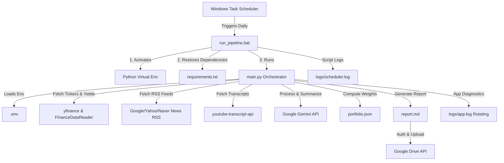

# Stock Discovery & Portfolio Rebalancing System: Deployment & Maintenance Plan

This document outlines the deployment architecture, configuration steps, scheduling automation, logging framework, and maintenance procedures for the Stock Discovery and Portfolio Rebalancing system.

---

## 1. System Overview & Deployment Architecture

The system operates as a daily automated pipeline on a Windows environment. It retrieves financial data, scrapes news feeds, downloads and summarizes YouTube transcripts via the Gemini API, evaluates stock criteria using the CANSLIM screener, checks portfolio balance weights, generates a markdown report, and uploads it directly to Google Drive.



---

## 2. Environment Configuration (`.env.example`)

A template file [`.env.example`](file:///c:/Users/samsung/proj/stockRecommnad/.env.example) has been created in the project root. To deploy, copy `.env.example` to `.env` and fill in the values.

### Env Configuration Parameter Details

| Variable Name | Required | Default Value | Description |
| :--- | :--- | :--- | :--- |
| `GEMINI_API_KEY` | **Yes** | *None* | API Key for Google Gemini. Used to summarize transcripts and compile final reports. |
| `GOOGLE_APPLICATION_CREDENTIALS` | **Yes** | `config/gdrive-service-account.json` | Absolute file path to the Google Cloud Service Account credentials JSON file. |
| `GOOGLE_DRIVE_FOLDER_ID` | **No** | *Root Drive* | Folder ID where daily reports are stored. Copy the string at the end of the folder's URL. |
| `US_WATCHLIST` | **No** | *config.py Default* | Comma-separated US tickers list (e.g. `AAPL,MSFT,NVDA`) to override hardcoded values. |
| `KR_WATCHLIST` | **No** | *config.py Default* | Comma-separated Korean tickers list (e.g. `005930.KS,000660.KS`) to override defaults. |
| `LOG_LEVEL` | **No** | `INFO` | Level of logging output: `DEBUG`, `INFO`, `WARNING`, `ERROR`, `CRITICAL`. |
| `LOG_FILE_PATH` | **No** | `logs/app.log` | Destination path for application logs. |
| `LOG_MAX_BYTES` | **No** | `5242880` (5 MB) | Byte threshold per log file before trigger rotation. |
| `LOG_BACKUP_COUNT` | **No** | `5` | Quantity of historical rotated logs to keep on disk. |
| `PORTFOLIO_FILE_PATH` | **No** | `portfolio.json` | Path to the local JSON file tracking current assets and target allocations. |

### Credentials Management & Security Rules

1. **API Key Security**:
   * **Never** commit `.env` or the Google Service Account JSON to version control.
   * Add `.env` and `*.json` (under `config/` or the root) to your `.gitignore` file.
2. **Google Cloud Service Account Configuration**:
   * Create a project in the [Google Cloud Console](https://console.cloud.google.com/).
   * Enable the **Google Drive API** and **YouTube Data API v3** (if channel resolution requires API fallback).
   * Navigate to *IAM & Admin > Service Accounts*, create an account, and generate a new **JSON key**.
   * Store the JSON key in `config/gdrive-service-account.json` (within the project folder but git-ignored).
   * **Crucial Step**: Copy the `client_email` from the JSON file and share the target Google Drive folder with that email address as an **Editor** so the script has write permissions.

---

## 3. Automation & Scheduling Guide

To execute the pipeline daily without manual intervention on Windows, we configure a Windows Task Scheduler task using our automated execution script [`run_pipeline.bat`](file:///c:/Users/samsung/proj/stockRecommnad/run_pipeline.bat).

### Step-by-Step Task Scheduler Configuration

1. **Open Task Scheduler**:
   * Press `Win + R`, type `taskschd.msc`, and press **Enter**.
2. **Create Basic Task**:
   * Click **Create Basic Task...** in the Actions pane.
   * **Name**: `Stock Discovery Pipeline`
   * **Description**: `Runs the daily stock discovery, YouTube summarization, and portfolio rebalancing pipeline.`
   * Click **Next**.
3. **Trigger**:
   * Select **Daily** and click **Next**.
   * **Start time**: Set to `06:00:00 AM` (to run and deliver reports before the Korean market opens, or adjust based on timezones). Recur every `1` day.
   * Click **Next**.
4. **Action**:
   * Select **Start a program** and click **Next**.
   * **Program/script**: Browse and select the script: `c:\Users\samsung\proj\stockRecommnad\run_pipeline.bat`
   * **Start in (optional)**: Set to `c:\Users\samsung\proj\stockRecommnad` (extremely important for relative paths).
   * Click **Next**.
5. **Finish**:
   * Check **Open the Properties dialog for this task when I click Finish** and click **Finish**.
6. **Configure Advanced Settings (Properties)**:
   * **Security Options**:
     * Select **Run whether user is logged on or not** to ensure it runs silently in the background when the user is locked or logged out.
     * Check **Run with highest privileges** if local folders require administrator read/write access.
   * **Settings Tab**:
     * Check **Run task as soon as possible after a scheduled start is missed** (ensures if the PC was shut down at 6:00 AM, the task executes immediately when powered on).
     * Check **Stop the task if it runs longer than** and set it to **1 hour** to prevent hung network connections (e.g., YouTube transcript scraper timeouts) from consuming memory indefinitely.
   * Click **OK** and enter your Windows user password when prompted to save the credentials.

---

## 4. Logging & Rotation Infrastructure

Logging is split into two channels to track scheduling operations and program execution details.

### Log Architecture

1. **Scheduler Log (`logs/scheduler.log`)**:
   * Written by the batch file `run_pipeline.bat`.
   * Captures high-level script execution states: virtual environment creation, `pip install` statuses, python invocation errors, and execution exit codes.
2. **Application Log (`logs/app.log`)**:
   * Managed by Python's native `logging` module.
   * Implements file-based logs with **rotation** using `logging.handlers.RotatingFileHandler` to prevent disk saturation.

### Python Logging Setup Implementation

The developer should implement the logging configuration in `app/logger.py` or the initialization code of `main.py` as follows:

```python
import os
import logging
from logging.handlers import RotatingFileHandler
from dotenv import load_dotenv

load_dotenv()

def setup_logger():
    log_level_str = os.getenv("LOG_LEVEL", "INFO").upper()
    log_level = getattr(logging, log_level_str, logging.INFO)
    
    log_file = os.getenv("LOG_FILE_PATH", "logs/app.log")
    
    # Ensure directory exists
    log_dir = os.path.dirname(log_file)
    if log_dir and not os.path.exists(log_dir):
        os.makedirs(log_dir)
        
    max_bytes = int(os.getenv("LOG_MAX_BYTES", 5242880)) # Default: 5MB
    backup_count = int(os.getenv("LOG_BACKUP_COUNT", 5))
    
    logger = logging.getLogger("StockDiscoveryPipeline")
    logger.setLevel(logging.DEBUG)  # Capture all levels at root, filter at handlers
    
    # Formatter: timestamp - level - [filename:line] - message
    formatter = logging.Formatter(
        "%(asctime)s - %(levelname)s - [%(filename)s:%(lineno)d] - %(message)s"
    )
    
    # File Handler with Rotation
    file_handler = RotatingFileHandler(
        log_file, maxBytes=max_bytes, backupCount=backup_count, encoding="utf-8"
    )
    file_handler.setLevel(log_level)
    file_handler.setFormatter(formatter)
    
    # Console Handler for interactive testing
    console_handler = logging.StreamHandler()
    console_handler.setLevel(log_level)
    console_handler.setFormatter(formatter)
    
    # Clear existing handlers to prevent duplicate logging
    if logger.hasHandlers():
        logger.handlers.clear()
        
    logger.addHandler(file_handler)
    logger.addHandler(console_handler)
    
    return logger
```

> [!TIP]
> **Why Rotate?** A 5 MB limit with 5 backups guarantees the log directory will never consume more than ~30 MB of disk space, protecting server or desktop resources during long-term headless runs.

---

## 5. Maintenance Checklist & Parser Outage Recovery

External scrapers and public APIs are volatile. The checklist below defines steps to diagnose and repair failures when third-party structures change.

### Failure Diagnostics Flow

```mermaid
flowchart TD
    Start[Pipeline Failure Alert] --> Log[1. Read logs/app.log & logs/scheduler.log]
    Log --> Identify{Determine Error Type}
    
    Identify -- youtube-transcript-api Error --   > YTCheck[2A. Check Video Transcript Status]
    Identify -- yfinance NaN/HTTP Error --         > YFCheck[2B. Check Yahoo Tickers / Update Lib]
    Identify -- googleapiclient HTTP 403/404 --    > GDriveCheck[2C. Check Credentials & Shares]
    
    YTCheck --> YTFix[Fix: Enable fallback to title-only or update channel handles]
    YFCheck --> YFFix[Fix: Update yfinance package or switch to FinanceDataReader fallback]
    GDriveCheck --> GDriveFix[Fix: Share folder with Service Account or renew credentials]
    
    YTFix --> Test[3. Run pytest & Dry-run main.py]
    YFFix --> Test
    GDriveFix --> Test
    
    Test --> Verify{Verification Succeeds?}
    Verify -- Yes --> End[Resume Scheduler]
    Verify -- No --> Support[Engage Developer]
```

### Outage Scenarios & Resolution Actions

#### A. YouTube Scraper Failure (`youtube_summarizer.py` breaks)
* **Symptoms**: Tracebacks mentioning `youtube_transcript_api.TranscriptsDisabled` or empty transcripts.
* **Troubleshooting Steps**:
  1. Check if the latest videos on the target channels have auto-generated subtitles. Some channels disable them, or Google may delay auto-transcription.
  2. Check if Google has blocked the crawler IP with a captcha requirement.
  3. Validate if the channel handles (e.g. `@3protv`) have changed, breaking RSS resolution.
* **Remediation Code Rules**:
  * **Fallback gracefully**: The `youtube_summarizer.py` module must wrap transcript downloading in a try-except block. If a video transcript fails, log a `WARNING` and fall back to using the video's title and description for summarization rather than raising an error and halting the pipeline.
  * **Configure handles in config**: Do not hardcode handles in the scraping loop. Keep them in `app/config.py` for rapid updates.

#### B. Finance API Schema Changes (`yfinance` or `FinanceDataReader` breaks)
* **Symptoms**: Warnings such as `Failed to get ticker data; returning NaN` or network errors during historical fetches.
* **Troubleshooting Steps**:
  1. Test the specific ticker directly in a scratch shell (e.g., `python -c "import yfinance as yf; print(yf.Ticker('AAPL').history(period='1d'))"`).
  2. If yfinance returns errors, it is likely due to Yahoo changing its internal API endpoint formatting.
* **Remediation**:
  1. Run `pip install --upgrade yfinance` to pull the latest patch.
  2. If the library remains broken, update `data_fetcher.py` to route data fetching through `FinanceDataReader` as a fallback mechanism.

#### C. Google Drive Upload Failures (`gdrive_uploader.py` breaks)
* **Symptoms**: API responses containing `HttpError 403 (Insufficient Permission)` or `HttpError 404 (File not found)`.
* **Troubleshooting Steps**:
  1. Open `config/gdrive-service-account.json` and verify the `client_email` address.
  2. Open Google Drive, right-click the destination folder, select **Share**, and check if the Service Account email is listed as an **Editor**. If the folder was deleted or recreated, the Folder ID in `.env` must be updated.
  3. Check if the Service Account keys have been disabled or deleted in the Google Cloud Console.

### Daily Verification Checklist (for DevOps/User)

- [ ] **Check Scheduler Run Status**: Ensure task scheduler shows "Last Run Result" as `0x0` (success).
- [ ] **Inspect Scheduler Log**: Open `logs/scheduler.log` and verify the script didn't raise errors during startup.
- [ ] **Inspect Application Log**: Check `logs/app.log` for any `WARNING` or `ERROR` items. Specifically search for "YouTube transcript failed" or "Ticker fetch failed".
- [ ] **Confirm File Upload**: Open Google Drive and verify a new report exists under the `Stock_Reports` folder with today's date stamp.
- [ ] **Verify Report Quality**: Open the report to confirm the Gemini LLM generated recommendations (e.g., sections are not blank, CANSLIM tables are populated).
