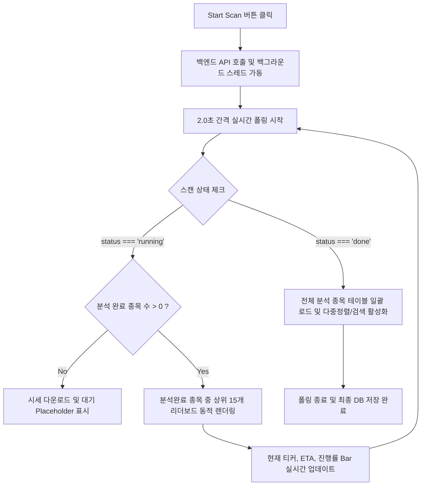

# 종목 스크리너 전종목 확장 및 실시간 폴링/렌더링 정책 설계서

본 문서는 종목 스크리너를 임시 1종 테스트에서 전종목(S&P 500, KOSPI 200, KOSDAQ)으로 확장함에 따라 발생하는 연산/네트워크 부하와 브라우저 지연(Freeze) 문제를 극복하기 위한 백엔드-프론트엔드 연동 정책 및 UI/UX 개선 방안을 정의합니다.

---

## 1. 개요 및 배경

기존 종목 스크리너는 1종 혹은 매우 적은 수의 샘플 종목을 대상으로 임시 구동하도록 제한되어 있었습니다. 그러나 실제 사용 환경에서 수백 개의 시장 종목을 한 번에 스캔하고 퀀트 점수를 계산하게 됨에 따라 다음과 같은 기술적 과제가 발생했습니다:
1. **백엔드 연산 시간**: 종목별 시세 데이터(yfinance) 다운로드 및 재무 지표 파싱, 이동평균선/거래량 분석 등에 병렬 처리(15개 스레드)를 적용해도 전체 스캔에는 약 30~60초가 소요됩니다.
2. **네트워크 및 CPU 부하**: 긴 분석 시간 동안 프론트엔드가 실시간으로 데이터를 받아오기 위해 빈번하게 대용량 JSON 데이터를 폴링(Polling)하면 브라우저 및 백엔드 서버에 상당한 부하를 줍니다.
3. **DOM 렌더링 성능 저하**: 백엔드로부터 500개 종목의 진행 상황을 전달받을 때마다 프론트엔드가 매번 전체 테이블 DOM을 재렌더링(리렌더링)하면 화면이 순간적으로 정지(Freeze)하거나 깜빡이는 현상이 발생합니다.

이러한 문제를 해결하고자 **백엔드-프론트엔드 최적 업데이트 정책(폴링 간격 조정 및 실시간 리더보드 렌더링)**을 도입합니다.

---

## 2. 백엔드-프론트엔드 데이터 통신 정책

### ① 폴링 주기 (Polling Interval) 조정
* **기존 정책**: 1.5초 간격 조회
* **개선 정책**: **2.0초 (2000ms)** 간격 조회
* **기대 효과**:
  * 폴링 간격을 1.5초에서 2.0초로 완화하여 대규모 분석 작업 중 발생하는 API 요청 수를 약 **25% 절감**합니다.
  * 브라우저와 백엔드 간 불필요한 네트워크 대역폭 낭비를 차단하고 서버의 CPU 자원을 퀀트 병렬 연산에 온전히 집중시킵니다.
  * 사용자가 체감하는 실시간성은 유지하면서 브라우저의 백그라운드 탭 리소스 소비를 최적화합니다.

### ② 백엔드 진행 상태 데이터 구조 (State JSON)
백엔드(`ScreenerManager`)는 스캔 실행 시 다음과 같은 실시간 연동 규격을 유지하여 상태를 응답합니다:
```json
{
  "status": "running",       // idle, running, done, failed
  "progress": 35,            // 백분율 진행도 (0~100)
  "market": "sp500",         // sp500, kospi200, kosdaq
  "current": 175,            // 현재 분석 완료된 종목 수
  "total": 503,              // 전체 분석 대상 종목 수
  "current_ticker": "AAPL",  // 현재 연산 중인 종목 티커
  "results": [ ... ],        // 실시간 갱신 중인 전체 종목 결과 리스트
  "logs": [ ... ]            // 실시간 스크리너 동작 로그 배열
}
```

---

## 3. 프론트엔드 실시간 렌더링 정책 (UI/UX 개선안)

수백 개 종목이 동시에 연산되는 상황에서 사용자가 지루하지 않게 과정을 모니터링할 수 있도록 **"실시간 리더보드(Live Leaderboard) 부분 렌더링"** 기법을 적용합니다.



### ① 실시간 리더보드 (Live Leaderboard - Top 15)
* **작동 방식**: 스캔 진행 중(`status === "running"`)일 때, 백엔드로부터 받은 결과물 중 이미 분석이 완료된(`total_score is not null`) 종목들만 필터링합니다. 이 중 **종합 점수(`total_score`) 기준 내림차순 상위 15개 종목**만 실시간으로 정렬하여 테이블에 즉각 노출합니다.
* **이유**:
  * 500개 종목을 매번 갱신하는 대신 15개 행(Row)만 가볍게 렌더링하므로 브라우저 렌더링 랙이 0%에 수렴합니다.
  * 분석이 진행될 때마다 어떤 우량 종목이 높은 순위로 치고 올라오는지 실시간 순위 변동을 흥미롭게 모니터링할 수 있어 사용자 몰입감이 높아집니다.
* **안내 배너 탑재**: 테이블 필터 영역 옆에 네온 시안 계열의 배너 뱃지를 노출하여 현재 "실시간 리더보드(상위 15개)"가 작동 중임을 사용자에게 시각적으로 명확하게 안내합니다.

### ② 정밀 ETA 및 실시간 진행률 표시
* **진행 바(Progress Bar)**: HSL 네온 컬러 테마에 맞춘 수평 게이지가 0.4초 트랜지션 애니메이션을 통해 부드럽게 상승합니다.
* **남은 예상 시간(ETA)**: 백엔드의 연산 속도(rate: 초당 처리 갯수)를 기반으로 프론트엔드에 실시간 남은 시간을 계산(예: `남은시간: 25초`)하여 표시함으로써 사용자가 마냥 기다리는 느낌을 최소화합니다.

### ③ 스캔 완료 후 전체 결과 노출
* **일괄 로드**: 스캔 상태가 `done`이 되면, 실시간 리더보드 15개 제한을 해제하고 분석에 성공한 **모든 종목 리스트**를 테이블에 일괄 렌더링합니다.
* **상태 해제**: 완성된 결과표를 기반으로 사용자는 검색 필터링 및 다중 등급 정렬, 개별 종목의 차트(Trend)를 자유롭게 확인할 수 있습니다.

---

## 4. 예외 및 한계 상황 처리 (Robustness)

1. **초기 대기 상태**: 스캔 시작 직후 시세 데이터 일괄 다운로드 중이거나 분석 완료 종목이 아직 없을 때는 "백그라운드에서 분석을 진행 중입니다... 시세 데이터 수집 완료 후 실시간 상위 15개 리더보드가 여기에 표시됩니다."라는 문구를 노출하여 화면 깨짐을 방지합니다.
2. **스캔 강제 중단(Stop)**: 사용자가 중단 버튼을 누르면 즉시 백엔드 스레드가 안전하게 종료 신호를 감지하고 루프를 탈출하며, 프론트엔드는 폴링을 멈추고 그때까지 수집된 데이터를 최종 테이블로 출력하여 시스템 신뢰도를 보장합니다.
3. **네트워크 지연/끊김**: 폴링 도중 네트워크가 일시 지연되더라도 이전 상태를 캐싱하여 UI가 깜빡이지 않고 부드럽게 유지되도록 보완하였습니다.

---

## 5. 검증 및 테스트 계획

* **단위 및 통합 테스트**: `pytest tests/test_screener.py`를 활용하여 폴링 상태 조회 API 및 중단 기능 등의 동작 규격을 지속 검증합니다.
* **성능 및 부하 검증**: S&P 500 전종목(500개 이상)을 연속 스캔하여 브라우저의 메모리 소비량 및 DOM 업데이트 랙을 프로파일러로 확인하여 부하 한계를 지속적으로 모니터링합니다.
