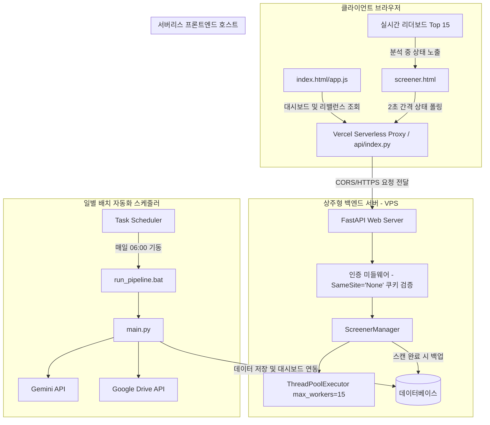
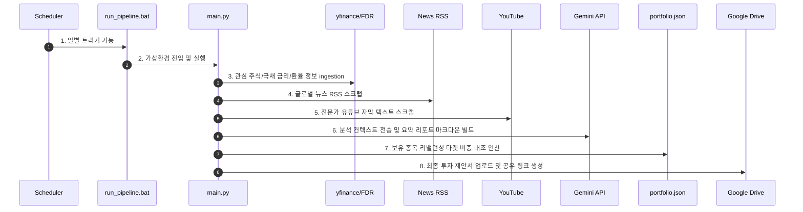

# 주식 발굴 및 포트폴리오 리밸런싱 시스템: 전체 구조 설계서

본 문서는 주식 추천 및 자산 배분 시스템의 전체 소프트웨어 아키텍처, 네트워크 연동 흐름, 그리고 컴포넌트 간 관계를 기술합니다. 해당 시스템은 크게 **일별 배치 자동화 파이프라인**과 **웹 서버 기반 실시간 스크리너** 두 영역으로 분리되어 있으며, 상주형 VPS(Cafe24)와 서버리스 프론트엔드(Vercel) 간 협동 구조로 구동됩니다.

---

## 1. 하이글로벌 시스템 구조도 (High-Level Overview)

전체 시스템은 다음과 같은 논리적 흐름으로 구성되며, PPTX 설계 파워포인트로 시각화되어 [system_architecture.pptx](file:///c:/Users/samsung/proj/stockRecommnad/design/system_architecture.pptx)에 수록되어 있습니다.

---

## 2. 일별 자동화 파이프라인 (Daily Batch Pipeline)

매일 정해진 시각(오전 6시)에 작동하여 거시 경제 데이터, 전문가 의견, 뉴스 RSS 피드를 수집하고 자산 비중 리밸런싱 추천 리포트를 생성 및 업로드합니다.

### 데이터 흐름도

---

## 3. 웹 서버 및 스크리너 실시간 연동 (Web Server & Screener)

사용자가 주식 스크리너 화면(`screener.html`)에서 실시간 스캔을 시작할 때 작동하는 백엔드-프론트엔드 실시간 연동 아키텍처입니다.

### 연동 핵심 설계 정책
1. **폴링 간격 (2.0초)**: 백엔드의 CPU 병렬 퀀트 연산 부하와 네트워크 전송 낭비를 방지하기 위해 조회 폴링 주기를 2.0초로 제한합니다.
2. **실시간 리더보드 (Top 15)**: 백엔드가 500개 종목을 스레드 풀(15개 워커)로 계산하는 동안, 프론트엔드는 분석 완료된 종목들만 실시간 정렬하여 상위 15개 리더보드만 테이블에 출력함으로써 브라우저 프리징(DOM Overload)을 원천 차단합니다.
3. **완료 후 일괄 로드**: 백그라운드 분석이 종료(`status === 'done'`)되면 전체 종목 결과를 프론트엔드 테이블에 바인딩하여 정렬 및 다중 검색을 지원합니다.
4. **쿠키 연동 (SameSite None, Secure)**: HTTPS 배포 환경에서 Vercel의 프론트엔드가 Cafe24 백엔드를 호출할 때 크로스사이트(Cross-Site) 인증 쿠키 `auth_token`이 온전히 전송될 수 있도록 보안 쿠키 정책을 동적으로 적용합니다.

### 컴포넌트 맵핑
* **[screener.html](file:///c:/Users/samsung/proj/stockRecommnad/app/static/screener.html)**: 2.0초 비동기 폴링 수신기 및 실시간 리더보드 렌더링 뷰.
* **[web_server.py](file:///c:/Users/samsung/proj/stockRecommnad/app/web_server.py)**: Uvicorn 호스팅, SameSite None 로그인 제어, 단일 중복 제거 API 라우트 관리.
* **[screener.py](file:///c:/Users/samsung/proj/stockRecommnad/app/screener.py)**: 백그라운드 워커 스레드 제어, yfinance 100종 묶음 다운로드 및 ThreadPoolExecutor(15개 스레드) 스캔 제어.
* **[scoring.py](file:///c:/Users/samsung/proj/stockRecommnad/app/scoring.py)**: yfinance info 정보(PER, PEG, EPS, Canslim) 기반 상대 퀀트 점수 산출 로직.

---

## 4. 물리 배포 아키텍처 (Deployment Structure)

* **프론트엔드 (Vercel)**:
  - 서버리스 아키텍처로 가동 비용이 없고 글로벌 CDN을 통해 정적 웹 리소스를 제공합니다.
  - Vercel의 제한으로 인해 실시간 상주 스레드 연산(Screener Worker)은 불가능하므로, 백엔드 로직 호출은 원격 Cafe24 VPS를 바라보게 설정합니다.
* **백엔드 (Cafe24 VPS)**:
  - Linux 기반 고정 IP 서버에서 Uvicorn/FastAPI 프로세스가 365일 상주합니다.
  - 백그라운드 스레드 및 데이터베이스(RDBMS) 저장이 보장되어 스크리너 및 리밸런싱 로직을 안정적으로 수행합니다.
